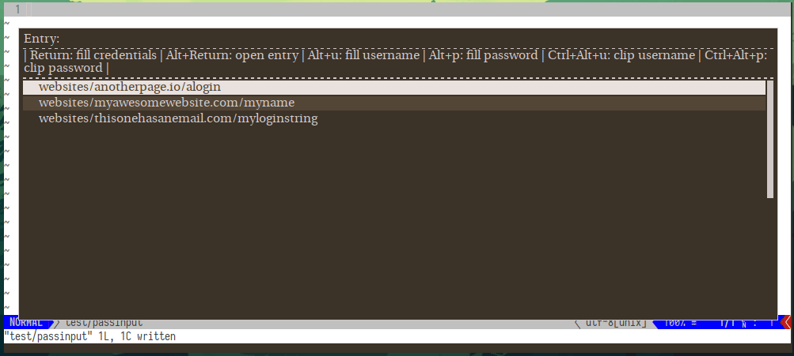

# 🗝 pass-pick ⛏

Easily select, copy, and auto-fill your [pass](https://www.passwordstore.org/) passwords from a drop-down menu.

<!-- TODO Insert promotional image here -->

* Works on both `X11` and `Wayland`
* Supporting `rofi`, `bemenu`, `dmenu` and custom pickers
* Has customizable auto-filling behavior to enter your username and password
* Can alternatively be used to paste password data
* Can select individual secret or metadata entries to paste or auto-fill
* Contains simple shortcuts for the above functionality
* Works with metadata obscuring pass extensions like [pass-tomb](https://github.com/roddhjav/pass-tomb) or [pass-coffin](https://github.com/ayushnix/pass-coffin)

## Getting Started



pass-pick allows you to interact with your password store through a variety of different dmenu-like selection tools, 
supporting rofi, bemenu and of course dmenu itself.
It works on systems running X11 and both Wayland configurations.
It allows you to quickly copy or fill individual password data, 
or dive into individual password entries and similarly interact with the password's metadata.

### Prerequisites

The prerequisites depend mostly on your choice of compositor and personal preference and are used for the different functionalities of this program:

on Wayland:

```
wl-clipboard     - for copying and pasting your password
wtype/ydotool    - for auto-filling your password
bemenu/rofi/wofi - as a menu for displaying and selecting from your password store
```

on X11:

```
xclip/xsel        - for copying and pasting your password
xdotool/ydotool   - for auto-filling your password
bemenu/rofi/dmenu - as a menu for displaying and selecting from your password store
```

In other words,
the choice of display menu is relatively free while that of the typing and pasting functionality is mostly restricted to what is available on your setup.

While `ydotool` works as a typing tool on both, 
it does not seem as reliable and a bit more cumbersome to set up than either of the other options but the option exists.

Pull requests or information to make the tool work correctly on a non-linux system welcome,
I have no experience of interacting with clipboards or typing automation tools on other systems.
The Wayland combination of `wl-clipboard`, `wtype` and `bemenu` is the most heavily used by me,
though any combination above should work well.

Lastly, if you wish to hide the metadata of your password store as well, 
`pass-pick` integrates smoothly with either the `pass-tomb` or `pass-coffin` extensions for the password manager.
If it finds a password store directory which seems to be locked by one of these extensions, 
it will automatically prompt you to open it before interacting with your passwords.
Afterwards it will close your password store again, hiding all metadata.

### Installing

#### Manual

Clone the repository somewhere you wish:

```sh
git clone https://git.martyoeh.me/Marty/pass-pick.git
```

And sym-link the script from your path:

```sh
ln -s pass-pick/pass-pick /usr/bin/pass-pick
```

Then simply start the program with `pass-pick` and you're good to go.

## Usage

Simply invoke `pass-pick` and the program should figure out most of the details for you and present you with a dropdown from which you can select an entry in your password store.
The default behavior on selecting an entry is to fill out both your username and password for the currently selected form fields in whatever application.

<!-- TODO Insert demonstration image here -->

The standard auto-filling procedure works by typing your username, 
hitting `tab` to move to the next field,
typing your password and leaving you only to hit send.

```
username
<tab>
password
```

This behavior, like many others, can be configured according to your needs.

### Key mappings

pass-pick comes with a variety of quick key mappings that you can use while you're in the menu.

Be aware that the mapped keys are *only* working in `bemenu` and `rofi` and only *reconfigurable* in `rofi`.

#### Rofi keys:

| keybinding         | function                                   | setting name            |
| --------           | --------                                   | ----------              |
| Return             | Auto-fill username & password              | KEY_AUTOFILL            |
| Alt+Return         | Open individual entry                      | KEY_ENTRY_OPEN          |
| Alt+u              | Auto-fill username                         | KEY_FILL_USER           |
| Alt+p              | Auto-fill password                         | KEY_FILL_PASS           |
| Ctrl+Alt+u         | Send username to clipboard                 | KEY_CLIP_USER           |
| Ctrl+Alt+p         | Send password to clipboard                 | KEY_CLIP_PASS           |
| From opened entry: |                                            |                         |
| Return             | Auto-fill selected field                   | KEY_ENTRYMENU_FILL      |
| Alt+Return         | Send selected field to clipboard           | KEY_ENTRYMENU_CLIP      |
| Alt+s              | Reveal contents of the password field      | KEY_ENTRYMENU_SHOWFIELD |
| Alt+BackSpace      | Return to password list overview           | KEY_ENTRYMENU_QUIT      |

#### Bemenu keys:

| keybinding         | function                              |
| --------           | --------                              |
| Return             | Auto-fill username & password         |
| Alt+6              | Open individual entry                 |
| Alt+4              | Auto-fill username                    |
| Alt+5              | Auto-fill password                    |
| Alt+2              | Send username to clipboard            |
| Alt+3              | Send password to clipboard            |
| From opened entry: |                                       |
| Return             | Auto-fill selected field              |
| Alt+2              | Send selected field to clipboard      |
| Alt+4              | Reveal contents of the password field |
| Alt+3              | Return to password list overview      |

## Configuration

The key mappings,
as well as any additional configuration can be changed by setting the corresponding environment variable
or through a configuration file.
The script tries to follow XDG-specification,
meaning it looks for a configuration file in the following directories (in descending order):

* `XDG_CONFIG_HOME/rofi-pass/rofi-pass.conf`
* `~/.config/rofi-pass/rofi-pass.conf`
* `~/.rofi-pass.conf`
* `/etc/rofi-pass.conf`

or, alternatively, a custom directory if the `PP_CONFIGURATION_FILE` variable points to a configuration file.

To use environment variables to configure any of these options or keys, prefix them with `PP_`, so that e.g. `KEY_AUTOFILL` becomes `PP_KEY_AUTOFILL`.
Environment variables take precedence over configuration file settings.

Look in the table above for the names of the options to remap keys.

Additional configuration options with their default values:

---

* `PICKER_BACKEND` \
  sets the tool to be used as interactive menu. 

  Can be used either to prefer an alternative to one of the default pickers for the program (`bemenu`, `rofi`, `dmenu`) if multiple are installed. Can also be used to invoke a completely different picker program whose functionality needs to mimic `dmenu` in that it takes its arguments trough `stdin`.

* `AUTOFILL_BACKEND=wtype` \
  sets the auto-filling tool used, one of `wtype`, `xdotool`, `ydotool`.

* `AUTOFILL_CHAIN='username :tab password'` \
  sets the chain of keys that should be sent to auto-fill an entry.

  Can use the following special fields: `:tab`, `:space`, `:return`, `username`, `password`.

  The default chain is `username :tab password`, which will enter the username, simulate the tab-key to switch from the username to the password field, and enter the password. This can be changed to suit your needs. To, for example, log in fully automatically at the end of the sequence, change it to `username :tab password :return`, and there will be no further user input for the login required.

* `AUTOFILL_DELAY=30` \
  sets the time for the typing tool to wait in-between simulated actions.

  If some letters appear missing or the fields are not switched between quickly enough, it can usually be fixed by increasing this delay (though typing will also take longer).

* `PASS_USERNAME_FIELD='username user login'` \
  sets the name of the field in the pass entry which contains the username.

  Usually, the default setting should be fine (it will look for `user`, then `username`, then `login`) but custom field names can be supplied. If multiple field names are given, it will use the first supplied field name a secret contains.

* `PASS_COFFIN_LOCATION` \
  if using a metadata-obscuring pass extension sets the location the coffin or tomb file.

  By default, pass-pick just expects the file to be in the same directory as the root password store.
  This option allows choosing a custom location for the rare occasion where it is necessary.

* `PASS_COFFIN_OPEN_TIME=0` \
  if using a metadata-obscuring pass extension sets the time the metadata is made visible.

  By default, pass-pick sets the time to `0` which means it will close the password store as soon as it has finished its operation. 
  If you wish to keep the store open longer you can enter a time frame here,
  which will be passed through to the extension.

```
  PASS_COFFIN_OPEN_TIME=30m
  PASS_COFFIN_OPEN_TIME=12h
```


## Contributing

Pull requests are welcome.
For major changes, please open an issue first to discuss what you would like to change. 
Otherwise, do not hesitate to contact me for issues or ideas.

## License

[GNU GPLv3](https://choosealicense.com/licenses/gpl-3.0/)

